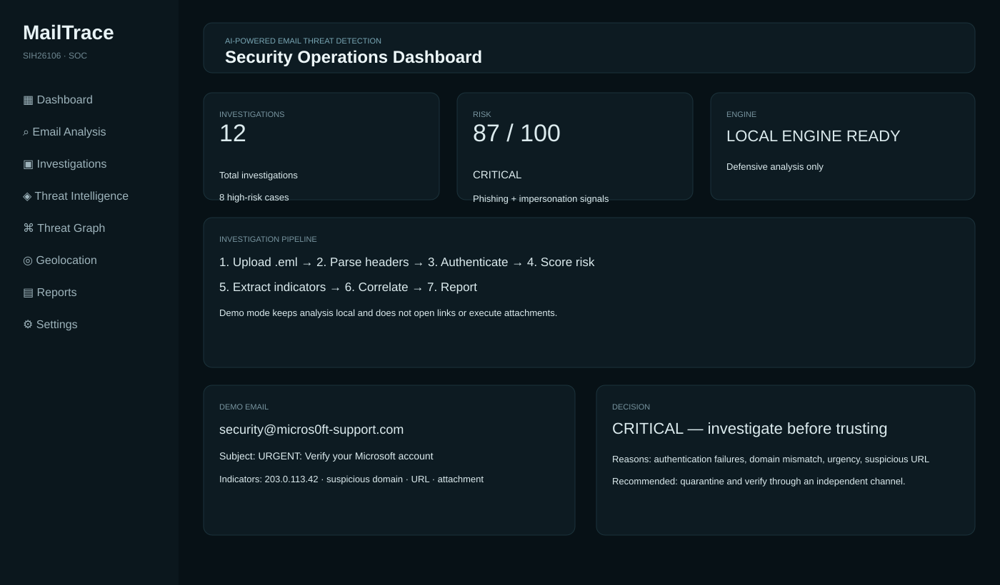
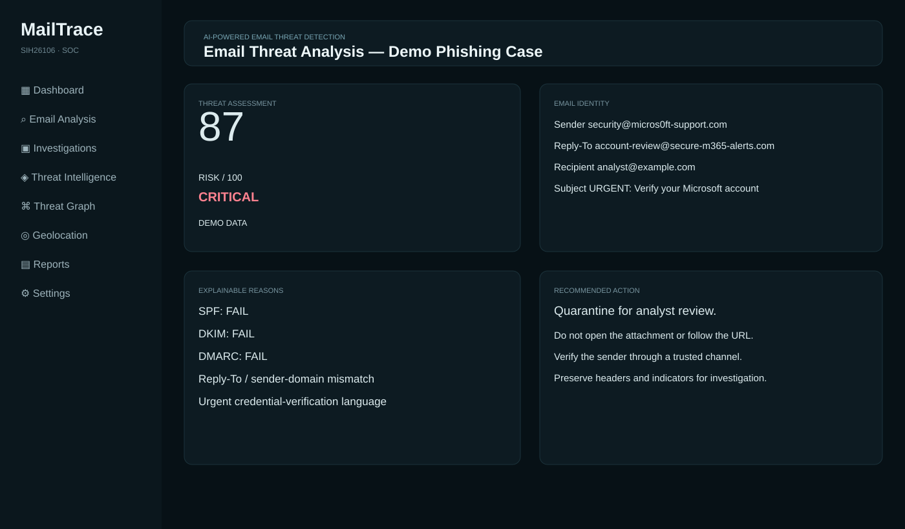
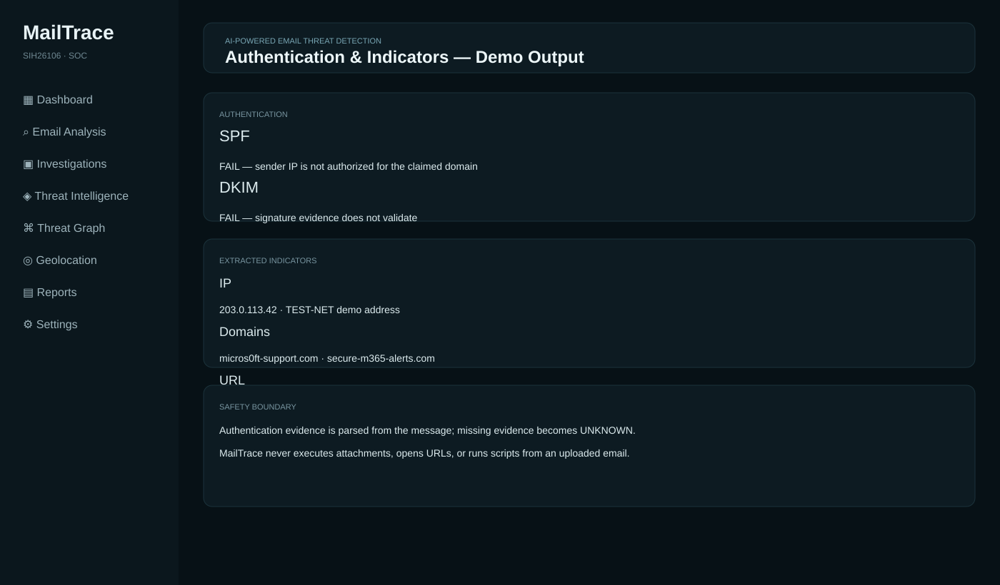
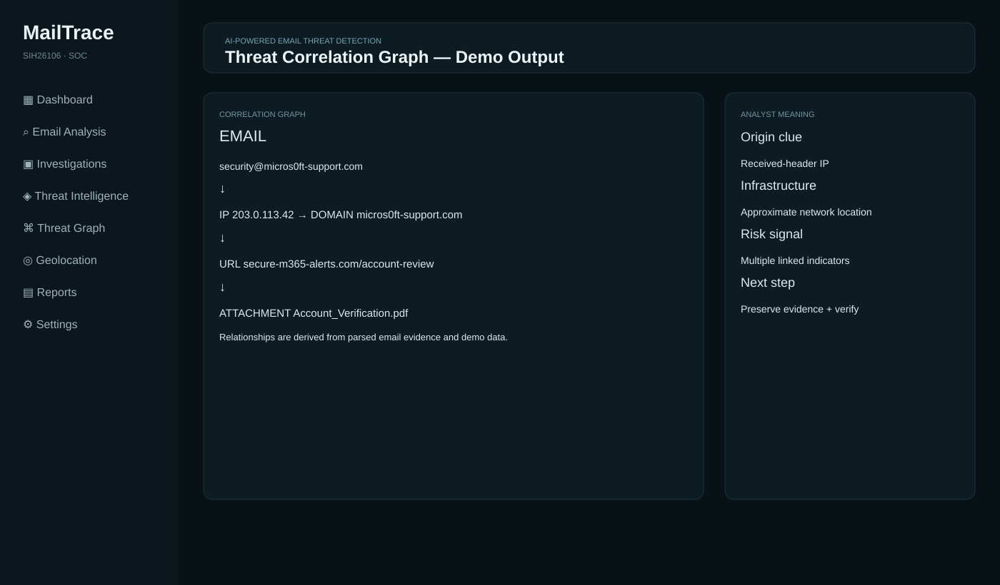
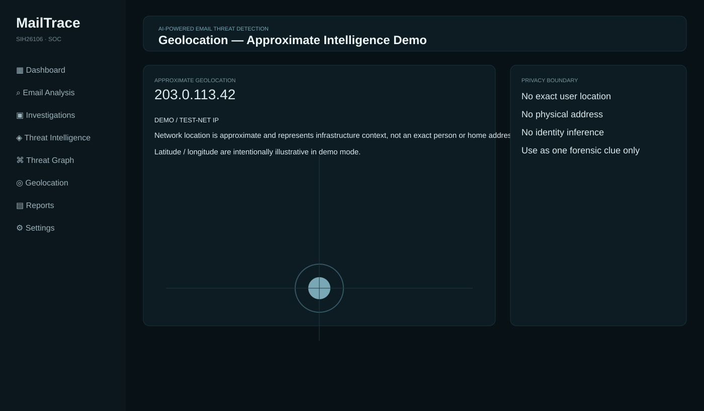
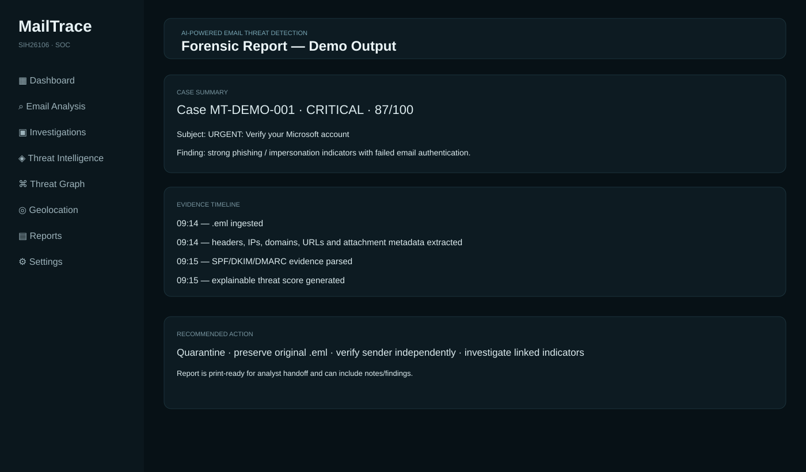

# MailTrace

**AI-Powered Email Threat Detection, GeoLocation & Forensic Intelligence Platform**  
**Smart India Hackathon 2026 · Problem Statement SIH26106**  
**Team Nova Tech**

MailTrace is a defensive email-forensics prototype that turns a suspicious `.eml` file into an explainable investigation: evidence extraction → authentication checks → threat scoring → indicator correlation → approximate infrastructure intelligence → forensic reporting.

## 🎯 What MailTrace Does

- Ingests `.eml` files safely as untrusted evidence.
- Extracts `From`, `Reply-To`, `Return-Path`, `Received`, `Message-ID`, IPs, domains, URLs and attachment metadata.
- Parses SPF / DKIM / DMARC evidence when present.
- Detects sender/reply-to mismatches, suspicious routing, urgency language and other phishing signals.
- Produces an explainable **0–100 threat score** and risk classification.
- Correlates email → IP → domain → URL → attachment relationships.
- Shows approximate IP/network geolocation as infrastructure context, **not exact user location**.
- Provides investigation notes, timeline, recommended action and a print-ready report.
- Includes safe benign and phishing demo emails for SIH presentation.

## 🖥️ Demo Outputs

### 1. Security Operations Dashboard



### 2. Email Threat Analysis



### 3. Authentication & Indicators



### 4. Threat Correlation Graph



### 5. Approximate Geolocation



### 6. Forensic Report



## 🔎 Demo Investigation Flow

```text
Suspicious .eml
      ↓
Safe parsing & evidence extraction
      ↓
Headers + IPs + domains + URLs + attachments
      ↓
SPF / DKIM / DMARC analysis
      ↓
Explainable threat scoring
      ↓
Threat intelligence boundaries
      ↓
IP / domain / URL correlation
      ↓
Approximate geolocation
      ↓
Investigation notes + timeline
      ↓
Print-ready forensic report
```

## 🧪 Try the Demo

1. Start the static prototype with Python: `python -m http.server 8080`
2. Open `http://localhost:8080`.
3. Click **Try Demo Investigation** for the phishing case.
4. Explore **Email Analysis → Authentication → Indicators → Message**.
5. Open **Investigations**, **Threat Graph**, **Geolocation**, and **Reports**.
6. Click **Try Safe Demo** to compare against the benign email.

No package installation or API key is required for the demo.

## 🛡️ Security & Privacy Boundaries

Uploaded email content is treated as untrusted. The prototype does **not** execute attachments, open extracted URLs, or run scripts from the email. Authentication results are not fabricated: unavailable evidence is shown as `UNKNOWN`.

IP geolocation is intentionally presented as approximate network/infrastructure context. It should not be interpreted as an exact physical location or identity of a sender.

For a real deployment, external threat-intelligence APIs, authentication, malware sandboxing, rate limiting, encrypted storage, audit logging and stronger isolation would be added.

## 🧱 Technology

### Working SIH prototype

- HTML5
- CSS3
- Vanilla JavaScript
- Browser `localStorage`
- Zero external runtime dependencies

### Future production architecture

- Next.js / React
- Python / FastAPI
- PostgreSQL / Supabase
- Redis
- scikit-learn / transformer-based NLP
- SPF / DKIM / DMARC validation
- Threat-intelligence providers
- Cytoscape.js / Leaflet-style visualizations

The repository also contains a partial TypeScript/Next.js backend skeleton showing the intended production direction. The zero-dependency static app is the reliable SIH demo path.

## 📁 Repository Structure

```text
MailTrace/
├── index.html                 # Prototype UI
├── styles.css                 # UI styling
├── app.js                     # Client-side analysis + views
├── data/
│   ├── demo-phishing.eml      # Safe phishing simulation
│   └── demo-benign.eml        # Safe benign simulation
├── public/demo/               # README demo visuals
├── lib/                       # TypeScript analysis/store skeleton
├── app/api/                   # Future API route skeletons
├── package.json               # Future Next.js dependencies
├── .env.example               # Environment variable template
├── run.sh                     # Linux/macOS helper
└── run.bat                    # Windows helper
```

## 📌 SIH Positioning

**MailTrace is not simply an email spam checker.** Its focus is explainable security investigation: it connects message evidence, authentication signals, network indicators and forensic context into one analyst workflow.

> **Email → Evidence → Authentication → Threat Score → Intelligence → Correlation → Investigation → Report**

## ⚠️ Prototype Disclaimer

This project is an academic/SIH defensive-security prototype. Demo intelligence and the `203.0.113.42` address are non-production/example data. A high threat score is an investigation signal, not proof of criminal intent or attribution.
